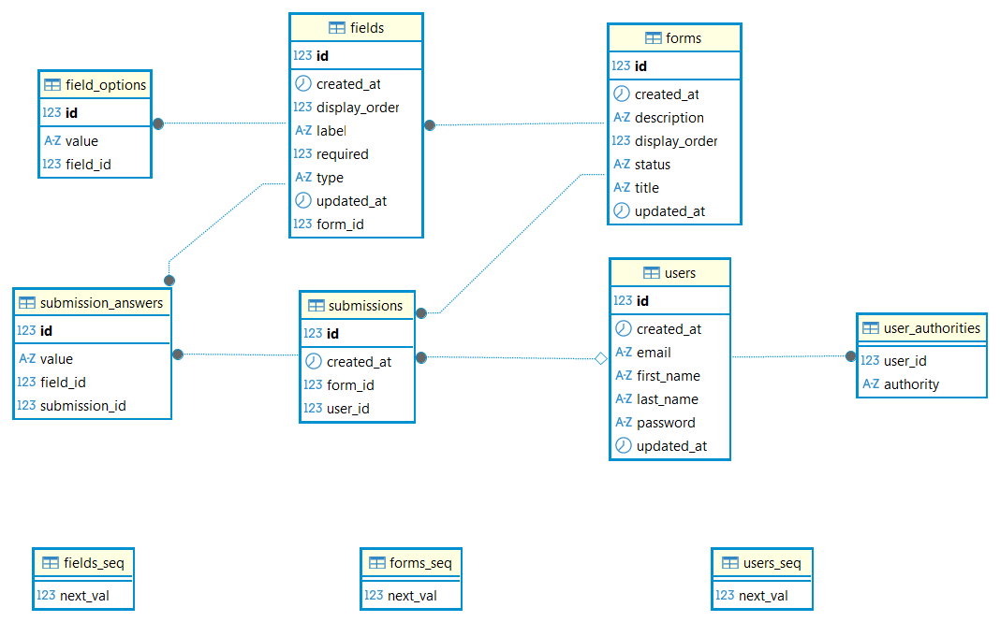
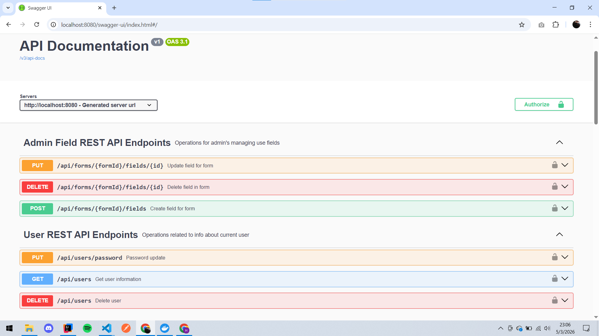
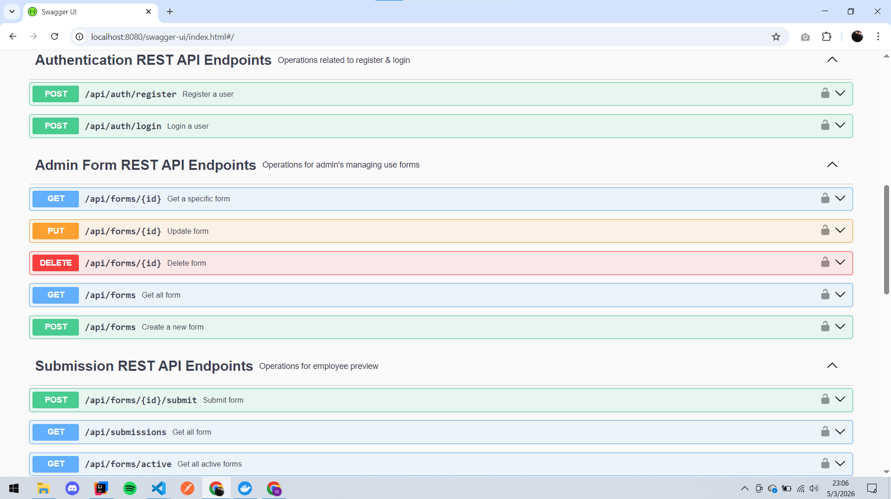
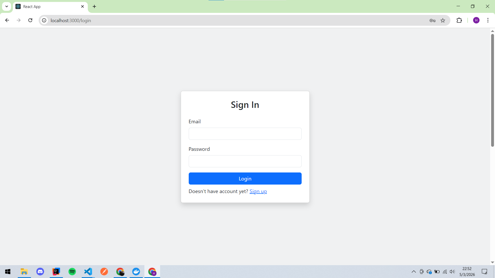
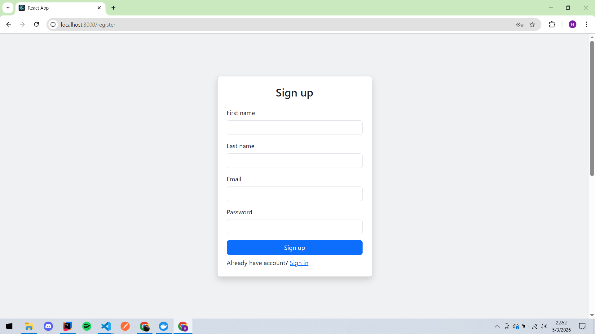
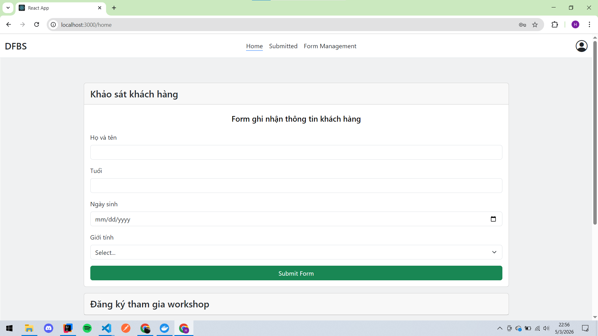
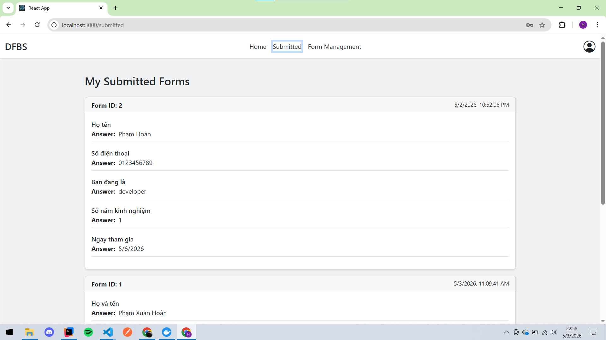
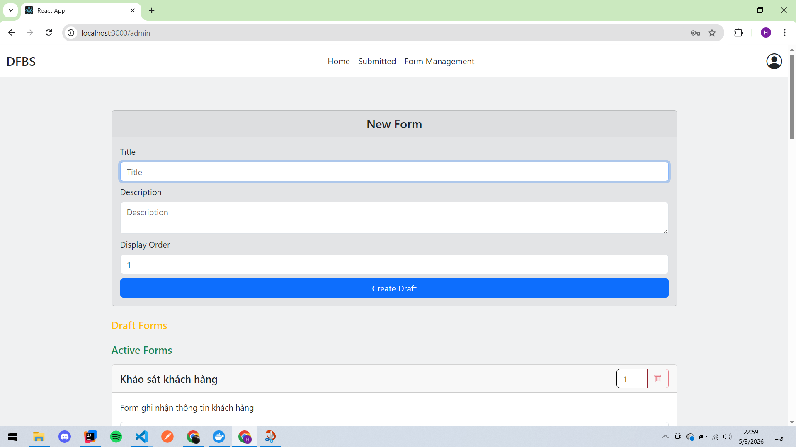
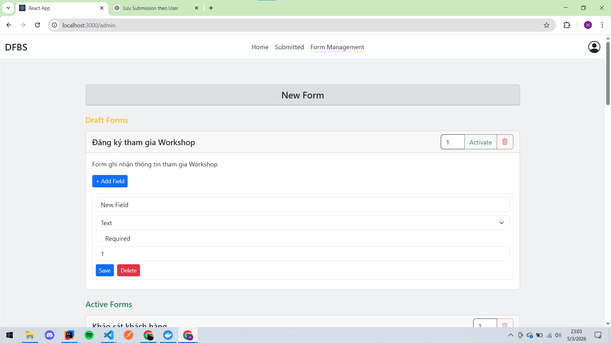
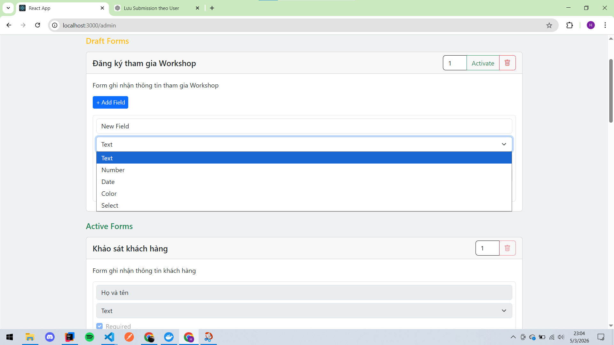

# Dynamic Form Builder System (ReactJS + Spring Boot + JWT)

## Giới thiệu

Đây là một ứng dụng điền form được xây dựng bằng:
 
 - Frontend: React
 - Backend: Spring Boot
 - Authentication: JWT (JSON Web Token)

Dự án được thực hiện bởi Phạm Xuân Hoàn.

## Tính năng chính

### Xác thực & Phân quyền

- Đăng ký tài khoản (Register)
- Đăng nhập (Login)
- Xác thực bằng JWT
- Phân quyền theo vai trò (User / Admin)

### Quản lý form (Form)

- Tạo form mới
- Xem danh sách các form
- Xem chi tiết form kèm theo field
- Cập nhật thông tin form
- Xóa form
- Đánh dấu Active/ Draft 

### Quản lý field (Field)
- Tạo field mới
- Cập nhật thông tin field
- Xóa field

### Quản lý submission (Submission)
- Xem danh sách các bài đã submit
- Tạo field mới
- Cập nhật thông tin field
- Xóa field

## Công nghệ sử dụng

### Backend

- Java Spring Boot
- Spring Security
- JWT (JSON Web Token)
- JPA / Hibernate
- MySQL

### Frontend

- ReactJS
- Axios
- React Router

## API

### Auth

- POST /api/auth/login 
- POST /api/auth/register

### Form

- POST /api/forms
- GET /api/forms
- GET /api/forms/:id
- PUT /api/forms/:id
- DELETE /api/forms/:id

### Field
- POST/api/forms/:id/fields
- PUT /api/forms/:id/fields/:fid
- DELETE /api/forms/:id/fields/:fid

### Submission
- GET /api/submission
- POST /api/forms/:id/fields
- PUT /api/forms/:id/fields/:fid
- DELETE /api/forms/:id/fields/:fid

## Demo

### Database diagram

  

### Swagger UI

#### Danh sách API Endpoints của dự án

  
  

### Auth

  
  

### Submission
#### Người dùng sẽ xem được các form đã Active và xem lại các form và câu trả lời đã submit

  
  

### Form
#### Chỉ admin mới được:
 - Thêm / sửa / xoá field (text, number, date, color, select)
 - Thêm / sửa / xoá form 

  
  
  

## Hướng dẫn cài đặt và chạy project

### Project gồm 2 phần:

 - Backend: Spring Boot + MySQL (Docker)
 - Frontend: ReactJS
## 1. Backend (Spring Boot)
### Yêu cầu
 - Java 17+
 - IntelliJ IDEA
 - Docker Desktop
 - (Khuyến nghị) DBeaver để quản lý database
### 1.1 Khởi tạo MySQL bằng Docker

Chạy lệnh sau để tạo database MySQL:

#### docker run -d -e MYSQL_ROOT_PASSWORD=secret -e MYSQL_DATABASE=DynamicFormSystem --name mysqldb -p 3307:3306 mysql:8.0

### 1.2 Thông tin database
 - Host: localhost
 - Port: 3307
 - Database: DynamicFormSystem
 - Username: root
 - Password: secret
### 1.3 Kết nối DBeaver (tuỳ chọn)
 - Mở DBeaver → New Connection → MySQL
 - Database: mysql
 - Host: localhost
 - Port: 3307
 - User: root
 - Password: secret

## Dùng để xem dữ liệu, query, debug database

### 1.4 Cấu hình Spring Boot

#### Trong file application.properties:

spring.datasource.url=jdbc:mysql://localhost:3307/DynamicFormSystem?serverTimezone=UTC&allowPublicKeyRetrieval=true&useSSL=false

spring.datasource.username=root
spring.datasource.password=scret

spring.jpa.hibernate.ddl-auto=update

spring.jpa.open-in-view=false

springdoc.swagger-ui.path=/docs

spring.jwt.secret=8e0c1567454f4f24a1a601c72278cc0828eccd47b0892b252465f0bf922d5160

spring.jwt.expiration=900000

### Khi chạy project:

 - Hibernate tự tạo bảng
 - Không cần tạo database thủ công
#### 1.5 Chạy backend (IntelliJ)
Mở project bằng IntelliJ
Run file main:
DynamicFormBuilderSystemApplication.java

#### Backend chạy tại:

http://localhost:8080
## 2. Frontend (ReactJS)
### Yêu cầu

 - Node.js (>=16) 

 - Visual Studio Code

### 2.1 Cài đặt dependencies

cd frontend

npm install

### 2.2 Chạy frontend
npm start

Frontend chạy tại:

http://localhost:3000
## 3. Luồng hoạt động hệ thống

Frontend (ReactJS) -> Backend (Spring Boot API) -> Database (MySQL Docker)

### Ghi chú
#### Database
 - MySQL chạy bằng Docker
 - Schema tự động tạo bằng Hibernate (ddl-auto=update)
 - Không cần tạo bảng thủ công
#### Công cụ hỗ trợ dev
 - IntelliJ: chạy backend
 - VS Code: chạy frontend
 - DBeaver: quản lý database

## Author
### Phạm Hoàn

- Email: hoanpham2911@gmail.com
- Github: https://github.com/Hoanpham29
